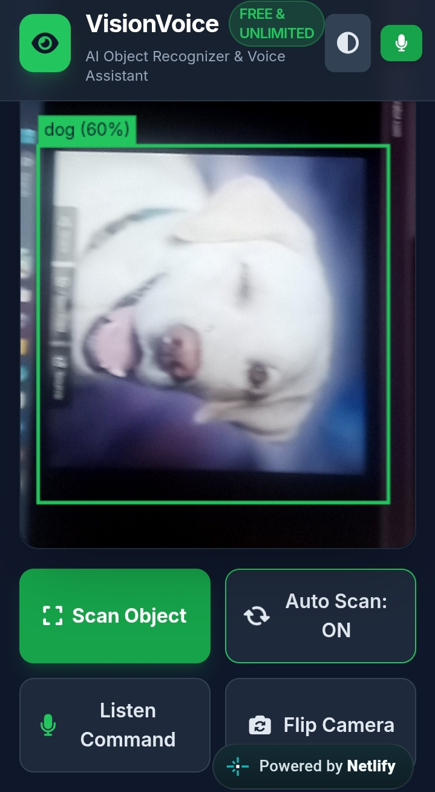
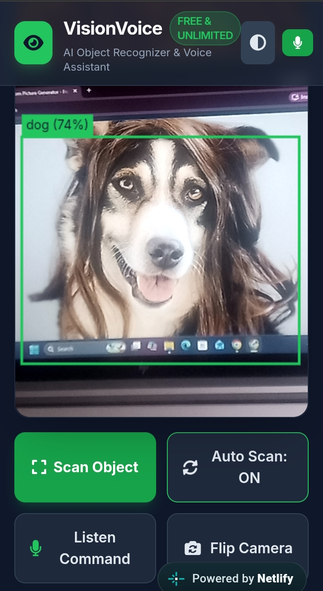
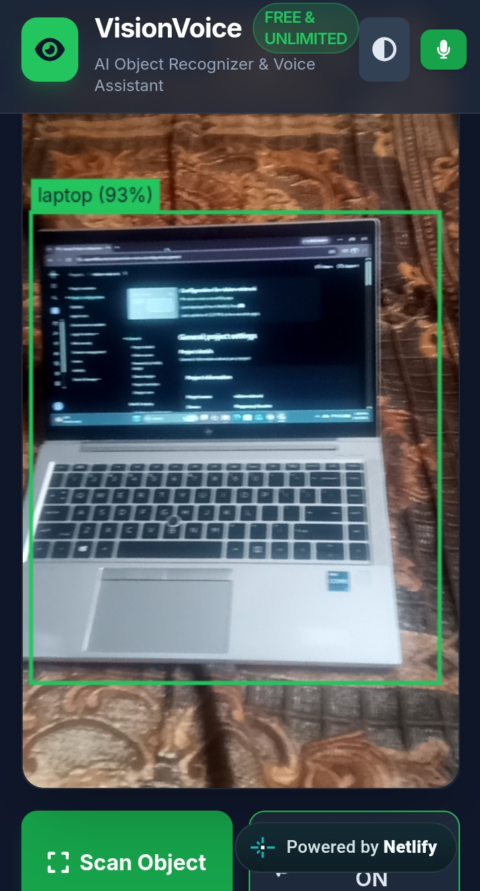
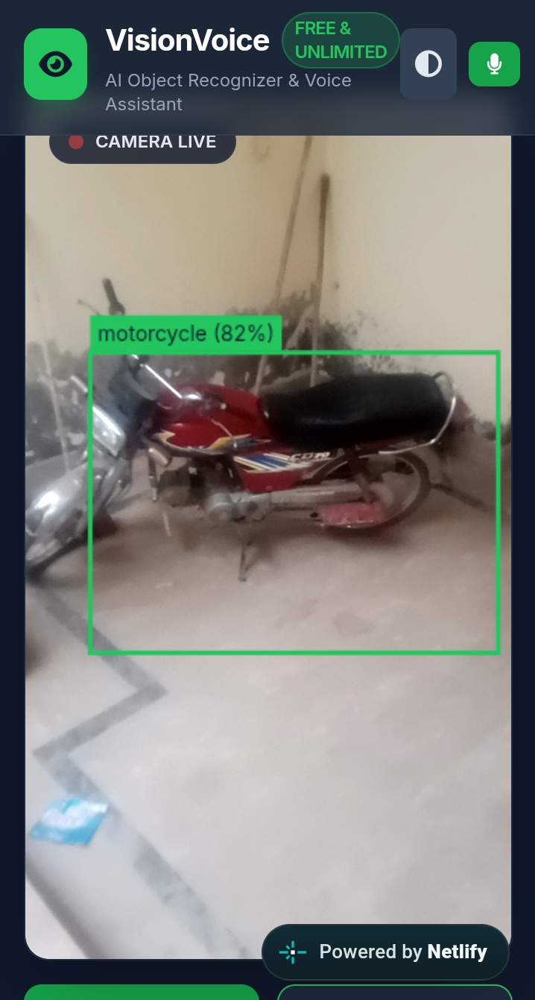
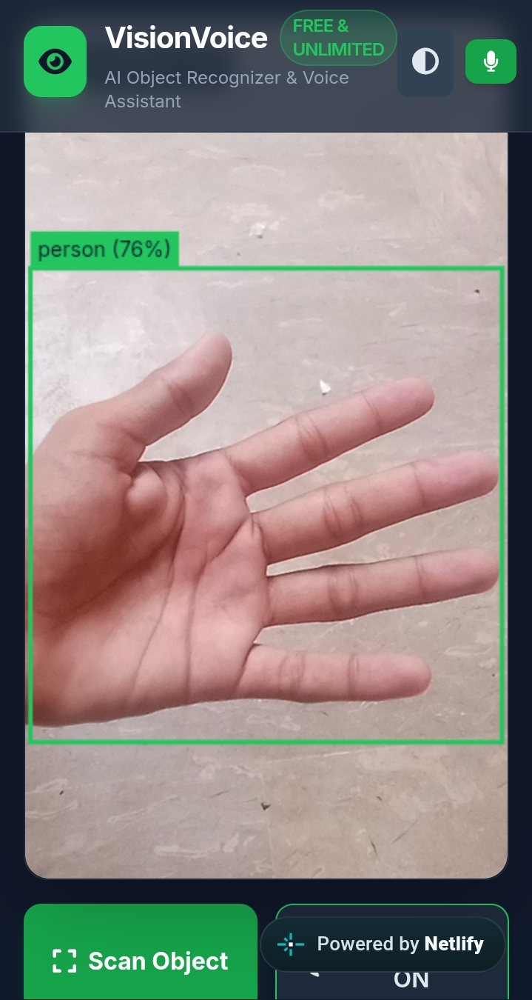

```markdown
# Vision Voice Object Recognizer

A free, lightweight, client-side web application that performs real-time AI object detection via webcam and responds to voice commands with English speech synthesis. Powered by TensorFlow.js and COCO-SSD, it runs 100% locally in your browser with zero server setup or API keys required.

---

## 📸 Screenshots

Here are visual examples of the object detection in action:

| Detection Example | Image |
| :--- | :--- |
| **Dog Detection (1)** |  |
| **Dog Detection (2)** |  |
| **Laptop Detection** |  |
| **Motorbike Detection** |  |
| **Person Detection** |  |

---

## ✨ Features

* **Real-time Detection:** Uses TensorFlow.js and the COCO-SSD model to identify up to 80 everyday object classes directly in the browser.
* **Voice Control:** Hands-free control with Web Speech API recognition (e.g., *"What do you see?"*, *"Start camera"*, *"Scan object"*).
* **Text-to-Speech (TTS):** Speaks out identified objects clearly in English.
* **100% Private & Local:** All computer vision processing occurs on your device—no video feeds or image data are sent to external servers.
* **Responsive UI:** Clean, mobile-friendly interface with real-time bounding boxes and detection overlays.

---

## 🚀 Quick Start

1. **Clone the Repository**
   ```bash
   git clone [https://github.com/MUdevelops/Vision-Voice-Object-Recognizer.git](https://github.com/MUdevelops/Vision-Voice-Object-Recognizer.git)

```

2. **Open the Application**
Simply open `index.html` in any modern web browser (Google Chrome, Microsoft Edge, or Brave recommended for optimal speech recognition support).
3. **Grant Permissions**
Allow access to your **Camera** and **Microphone** when prompted.

---

## 🗣️ Voice Commands

| Command | Action |
| --- | --- |
| `"Start camera"` / `"Turn on camera"` | Activates the webcam feed |
| `"Stop camera"` / `"Turn off camera"` | Deactivates the webcam feed |
| `"What do you see?"` / `"Scan object"` | Triggers immediate detection and reads results aloud |
| `"Read objects"` | Speaks the list of currently detected objects |

---

## 🛠️ Built With

* **HTML5 / CSS3 / JavaScript** (Single-file application)
* **[TensorFlow.js](https://www.tensorflow.org/js)** — Machine learning library for JavaScript
* **[COCO-SSD](https://github.com/tensorflow/tfjs-models/tree/master/coco-ssd)** — Pre-trained object detection model
* **Web Speech API** — Speech Recognition & Speech Synthesis

---

## 📄 License

This project is licensed under the [MIT License](https://www.google.com/search?q=LICENSE).

```

```
